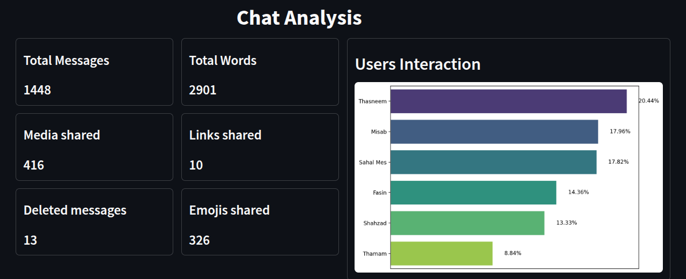
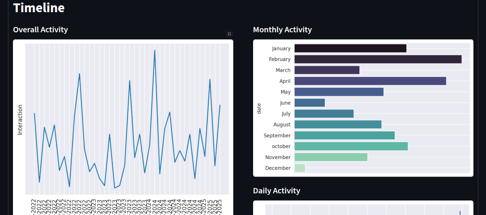

# 📑 Chat Tracker - WhatsApp Chat Analyzer

Chat Tracker is an intelligent and interactive web application designed to analyze and summarize exported WhatsApp chat files. Whether it’s a one-on-one conversation or a group chat, Chat Tracker reveals fascinating insights into your conversations with a clean, user-friendly interface built using Streamlit.


**🌐 checkout the application [Click here](https://chat-trackr.streamlit.app/)**

> The application may take some time to respond after periods of inactivity due to resource optimization


## 🌟 Features
### 📌 Comprehensive Chat Analysis
- **Total Messages:** See the overall message count in individual or group chats.
- **Media & Links Shared:** Track how many images, videos, and links were exchanged.
- **Deleted Messages:** Detect how many messages were deleted in the conversation.
### 👥 User-Specific Insights (Group Chats)
- **Most Active User:** Find out who dominates the conversation.
- **Least Active User:** Identify silent participants.
- **User-wise Stats:** Breakdown of messages, media, links, and deleted messages per user.
### 📅 Timeline & Activity Trends
- **Hourly Activity:** Check which time of the day the chat is most active.
- **Daily & Weekly Trends:** Analyze chat patterns over weekdays and weekends.
- **Monthly Breakdown:** Observe how messaging frequency changes month-wise.
### 😃 Emoji & Text Analysis
- Top Emojis Used: Discover the most frequently used emojis in the chat.
- Most Common Words: See which words dominate the conversation.
- Sentiment Trends (Future Scope): Get a glimpse of the emotional tone of chats.
### 📂 Easy Upload & Processing
- Simply export your WhatsApp chat (without media) and upload it to Chat Tracker.
- Instant analysis with interactive charts and visualizations.

## 🚀 How to Use?
#### Step 1: Export Your WhatsApp Chat
-  **Open WhatsApp and navigate to the chat:**
Open the WhatsApp application and go to the individual or group chat you want to export.
-  **Access More Options:**
Tap on the three vertical dots (More options) in the upper right corner of the chat window. 
-  **Select Export Chat:**
In the More options menu, select "Export chat". 
-  **Choose Media (Optional):**
You'll be prompted to choose whether to include or exclude media (images, videos, etc.) in the export. 
-  **Select Export Method:**
Choose your preferred method to export the chat history, such as sending it via email, saving it to Notes, or using another available option. 

#### step 2: Open Chat Trakr.
#### step 3: Upload the exported zip file.
#### 🎈 Instantly explore beautifully presented insights and statistics.

## 📷 Screenshots




## 📋 Installation Instructions

To get started with this project, follow the instructions below to set up the environment and install the necessary dependencies.


```bash
# clone this repo
git clone https://github.com/Shabeenabd/ChatTrakr-WhatsappChatAnalyzer.git
cd ChatTrakr-WhatsappChatAnalyzer.git

# Create a virtual environment
python3 -m venv venv

# Activate the virtual environment
# For Windows
venv\Scripts\activate

# For macOS/Linux
source venv/bin/activate

# Install the required Python dependencies
pip install -r requirements.txt

```

## 🎯 Project Structure

```bash
ChatTrackr/
│
├── app                                            # Web Application 
│    ├── app.py                                    
│    └── helper.py                                 # helper functions for the streamlit application
│   
├── data                                           # whatsapp exported chats
│     ├── whatsappchat_1.zip                               
│     └── whatsappchat_2.zip                               
│  
├── src                                         
│     └── chat analyzer.ipynb                      # Jupyter notebook for preprocessing and visualization
│
├── requirements.txt                               # Project Dependencies
│
└── README.md                                      # This README file
```

## 🤝 Contributing
Contributions, issues, and feature requests are welcome!
Feel free to check out the issues page or submit a pull request.
